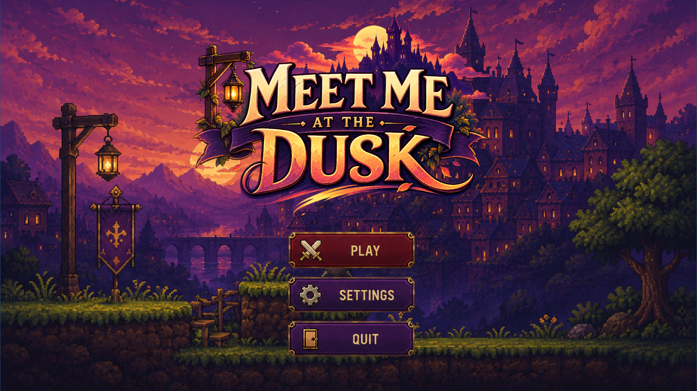
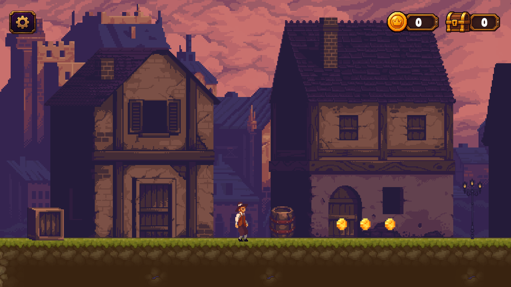
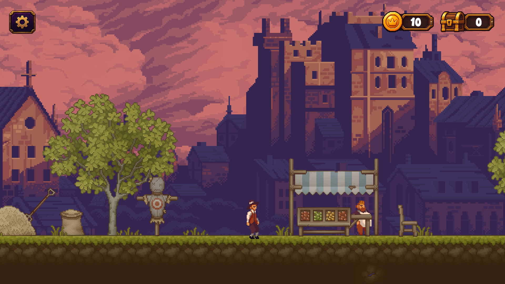
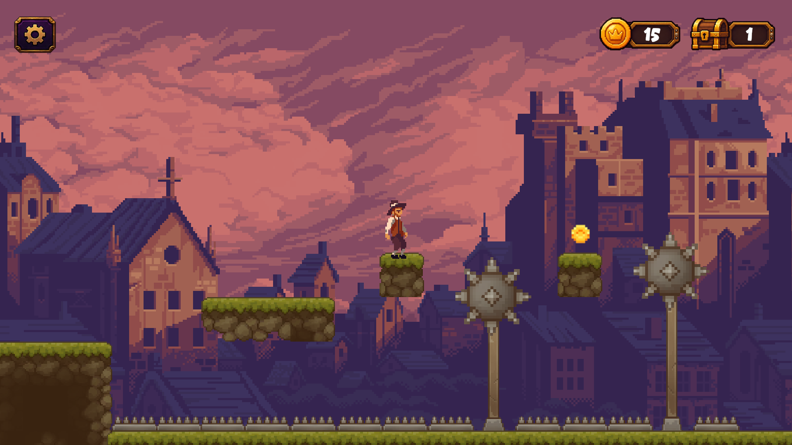

# Meet Me at Dusk

A pixel-art 2D platformer set in a lantern-lit medieval town at dusk. Guide your character through the shadowed streets, collect coins and treasure chests, and leap across dangerous platforms while avoiding spike pits and blade traps.

## Project

- Engine: Unity
- Genre: 2D platformer
- Visual style: Pixel art
- Project folders: `Assets`, `Packages`, and `ProjectSettings`

Open the project folder in Unity Hub using a compatible Unity editor version.

## Screenshots

### Title screen

### Exploring the town

### Town market

### Platforming hazards

